<!-- Header Banner -->

  

---

## Professional Summary

AI Platform and MLOps Engineer with experience building production-grade Kubernetes infrastructure, Agentic AI systems, and enterprise data platforms. Proven track record deploying Large Language Model (LLM) and Retrieval-Augmented Generation (RAG) pipelines on Kubernetes clusters, architecting fine-grained authorization infrastructure (Keycloak, OpenFGA, APISIX), and leading end-to-end client deployments. Experienced in Model Context Protocol (MCP), multi-agent orchestration, ETL/ELT pipelines, and API gateway design.

---

## Experience Highlights

### AI Platform Engineer (Data Scientist)
**SK International** | Dadar, Mumbai | August 2025 - Present
- Architected enterprise API key management infrastructure featuring scope-based access control, public/private key lifecycle management, and detailed audit logging.
- Led the integration of Apache NiFi, Airflow, and OpenMetadata for automated ETL pipelines and data governance across enterprise clients.
- Engineered production-grade authorization and RBAC using Keycloak, OpenFGA, and APISIX, implementing user isolation across Agentic AI modules.
- Managed API gateway migration from Kong to APISIX, optimizing routing, rate-limiting, and security policies for LLM inference endpoints.
- Developed custom encryption layers for data-in-transit between Airbyte and PostgreSQL, successfully passing enterprise security audits.

### MLOps / DevOps Intern
**Data Science Wizards** | Mumbai | February 2025 - July 2025
- Deployed RAG agents on Kubernetes using Helm and Horizontal Pod Autoscaling (HPA), reducing query latency by 30%.
- Engineered Kafka and Change Data Capture (CDC) data aggregator pipelines on Kubernetes, cutting data sync time by 40%.
- Orchestrated Apache Airflow on Kubernetes utilizing custom StatefulSets and Persistent Volumes (PVs) for versioned ML workflows.

---

## Production Agentic AI & MLOps Architecture

This visual flow represents a typical request loop within my deployment architecture. Natural language commands pass through the secure API gateway layer, route into the Agent Control Plane utilizing Smaran memory and the Model Context Protocol, and execute actions dynamically across the Kubernetes execution plane and database layers.

  

---

## Core Projects

### Smaran
- AI agent memory management system exposed via the Model Context Protocol (MCP) and installable as a Python package. 
- Enables persistent, structured memory across agent sessions for production Agentic AI workflows.

### Shell Story
- Terminal session recorder that feeds shell commands to a swarm of agents, auto-generating structured deployment documentation in Markdown and PDF formats. 
- Designed to train future agents for repeatable, error-handled deployments.

### k8s-mcp & ks-ai
- Go-based multi-cluster pod management command line interface (CLI) with a terminal user interface (TUI) for natural language Kubernetes operations via Gemini-powered agents.

### PruneX
- Automated feature engineering and feature selection library (available on PyPI) that performs preprocessing, encoding, dimensionality reduction, and leakage detection using deterministic statistical methods.

---

## Technical Capabilities

  

---

## GitHub Metrics

  
  &nbsp;&nbsp;
  

  

---

## Contact

  
  &nbsp;&nbsp;
  

